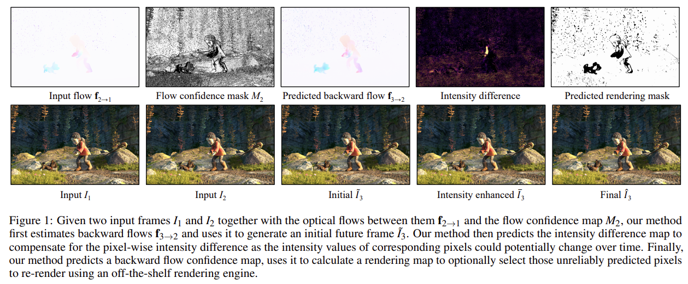

## [Paper](https://openreview.net/forum?id=HI9zjeYVaG9) | [Youtube](https://youtu.be/CHpYz3D6ig4?t=574) 
Official PyTorch implementation of Future Frame Synthesis for Fast Monte Carlo Rendering.<br>

## Future Frame Synthesis for Fast Monte Carlo Rendering<br>
Zhan Li<sup>1</sup>, Carl S Marshall<sup>2</sup>, Deepak S Vembar<sup>2</sup>, [Feng Liu](http://web.cecs.pdx.edu/~fliu/) <sup>1</sup>, <br>
 <sup>1</sup>Portland State University, <sup>2</sup>Intel <br>
**Graphic Interface 2022**
 

## Set up environment with conda (ubuntu only)
```shell
conda create --name nfe python
conda activate nfe
pip install -r requirements.txt
```
checked with python 3.10.4 and conda 4.12.0 <br/>

## Download demo data folder with pretrained weight. 
[data folder]()
place unzipped data folder under NFE, so it would be like 
```shell
NFE
├── data
├── code

```

## Run inference demo
```shell
export NFEDIR=$(pwd); # add NFEDIR 
cd code; # cd to code dir
python main_sq.py --eval  --write_images --mywrite 1 --val_n_batches -1 --resume $NFEDIR"/data/modelweight/br_0.3-cr_0.3-mlv_1-limgain_0-L_3-mask_F-phase_fused-pr_0.3-tr_0.5/best.pt.tar" --threshold 0.4 --br 0.3 --cr 0.3 --model FPCGE --phase fused --pr 0.3 --save $NFEDIR"/data/output" --tr 0.5 --train_file $NFEDIR"/data/trainingset" --val_file $NFEDIR"/data/input" --timing 1
```
Image results will be saved at data/output/FPCGE directory
## Citation
If you find this repository useful for your research, please use the following.

```
@inproceedings{
li2022future,
title={Future Frame Synthesis for Fast Monte Carlo Rendering},
author={Zhan Li and Carl S Marshall and Deepak S Vembar and Feng Liu},
booktitle={Graphics Interface 2022},
year={2022},
url={https://openreview.net/forum?id=HI9zjeYVaG9}
}
```


## Acknowledgments
This project is supported by a gift from Intel.

The codes are heavily based on [SDC-Net: Video prediction using spatially-displaced convolution](https://openaccess.thecvf.com/content_ECCV_2018/papers/Fitsum_Reda_SDC-Net_Video_prediction_ECCV_2018_paper.pdf) and [Improving Semantic Segmentation via Video Propagation and Label Relaxation](https://github.com/bryanyzhu/semantic-segmentation). <br/>

Our another interesting Fast Monte Carlo Rendering Paper. <br/>
[Fast Monte Carlo Rendering via Multi-Resolution Sampling
](https://github.com/hqqxyy/msspl)